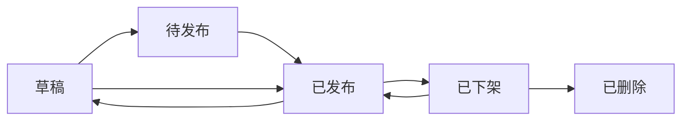

# 专题活动管理系统 (TopicActivityBundle) 产品需求文档

**版本**: 1.0  
**日期**: 2025年8月8日  
**技术栈**: Symfony 7.3 + PHP 8.2+ + EasyAdmin 4.x + Twig Components

---

## 1. 项目概述

### 1.1 背景与目标

公司经常需要制作各类营销推广的专题活动页面（如新品发布、节日促销、限时优惠等）。传统方式需要开发人员逐个编写页面，效率低下且占用大量研发资源。为提升运营效率、降低开发成本，我们计划开发一个基于 Symfony 7.3 的专题活动管理系统。

**核心目标**：
- **提升效率**：运营人员无需依赖开发即可独立完成活动页面搭建与发布
- **降低成本**：减少90%以上的活动页面开发工作量
- **增强灵活性**：通过可视化拖拽编辑器和丰富组件库满足多样化营销需求
- **数据驱动**：提供完善的数据分析功能，支持活动效果追踪和优化

### 1.2 目标用户

| 用户角色 | 核心诉求 | 使用场景 |
|---------|---------|---------|
| **运营人员** | - 通过图形化界面快速创建和修改活动页<br>- 需要丰富的组件展示不同内容<br>- 实时预览不同设备上的效果<br>- 查看活动数据分析报告 | 日常活动页面制作、活动效果监控 |
| **市场人员** | - 快速响应市场热点制作专题页<br>- 灵活调整页面内容和布局<br>- A/B测试优化转化率 | 营销活动策划、效果优化 |
| **开发人员** | - 结构清晰、易于维护的Bundle<br>- 方便扩展新组件和模板<br>- 完善的事件钩子和扩展接口 | 系统维护、功能扩展 |
| **管理人员** | - 活动效果数据分析<br>- 团队工作效率统计<br>- ROI评估报告 | 业务决策、资源分配 |

## 2. 功能架构

### 2.1 系统架构图

```
┌─────────────────────────────────────────────────────────────┐
│                      EasyAdmin 后台管理界面                    │
├─────────────────────────────────────────────────────────────┤
│  活动管理  │  可视化编辑器  │  模板管理  │  数据分析  │  系统配置  │
├─────────────────────────────────────────────────────────────┤
│                    TopicActivityBundle 核心层                 │
│  ┌──────────┐  ┌──────────┐  ┌──────────┐  ┌──────────┐   │
│  │ 活动实体  │  │ 组件系统  │  │ 模板引擎  │  │ 统计分析  │   │
│  └──────────┘  └──────────┘  └──────────┘  └──────────┘   │
├─────────────────────────────────────────────────────────────┤
│                    Symfony 7.3 Framework                     │
│  Doctrine ORM │ Twig Components │ Event System │ Security   │
└─────────────────────────────────────────────────────────────┘
```

### 2.2 核心功能模块

1. **活动生命周期管理**：创建、编辑、预览、发布、下架、删除
2. **可视化编辑器**：拖拽式布局、实时预览、响应式设计
3. **组件系统**：预置组件库、自定义组件扩展
4. **模板管理**：预设模板、模板市场
5. **数据分析**：访问统计、转化分析、A/B测试
6. **权限管理**：基于角色的访问控制

## 3. 详细功能需求

### 3.1 活动生命周期管理

#### 3.1.1 状态流转



| 状态 | 说明 | 可执行操作 | 前台可见性 |
|-----|------|-----------|----------|
| **草稿** | 已创建但未发布 | 编辑、预览、发布、删除、复制 | 不可见 |
| **待发布** | 设置了定时发布 | 编辑、预览、取消定时、删除 | 不可见 |
| **已发布** | 活动进行中 | 编辑、预览、下架、复制、查看数据 | 可见 |
| **已下架** | 活动已结束 | 预览、重新发布、删除、复制、查看数据 | 不可见 |
| **已删除** | 软删除状态 | 恢复（需管理员权限） | 不可见 |

#### 3.1.2 活动属性

- **基础信息**：标题、描述、封面图、SEO设置
- **时间控制**：开始时间、结束时间、定时发布
- **访问控制**：访问密码、地域限制、设备限制
- **分享设置**：自定义分享标题、描述、缩略图

### 3.2 可视化编辑器

#### 3.2.1 界面布局

```
┌────────────────────────────────────────────────────────────────┐
│                         顶部工具栏                               │
│  [保存] [预览] [发布] [撤销] [重做] | [PC] [Pad] [Mobile] [设置] │
├──────────────┬────────────────────────────┬───────────────────┤
│              │                            │                   │
│   组件面板    │        画布区域             │    属性面板       │
│              │                            │                   │
│ ┌──────────┐ │  ┌────────────────────┐  │ ┌───────────────┐│
│ │ 基础组件  │ │  │                    │  │ │  组件属性设置   ││
│ ├──────────┤ │  │   页面实时预览区     │  │ ├───────────────┤│
│ │ 营销组件  │ │  │                    │  │ │  样式设置      ││
│ ├──────────┤ │  │   支持拖拽调整      │  │ ├───────────────┤│
│ │ 表单组件  │ │  │                    │  │ │  动画设置      ││
│ ├──────────┤ │  └────────────────────┘  │ ├───────────────┤│
│ │ 高级组件  │ │                           │ │  事件设置      ││
│ └──────────┘ │                           │ └───────────────┘│
└──────────────┴────────────────────────────┴───────────────────┘
```

#### 3.2.2 核心功能

- **拖拽操作**：从组件面板拖拽到画布、画布内组件位置调整
- **实时预览**：所见即所得，支持PC/平板/移动端切换
- **撤销重做**：支持多步操作的撤销和重做
- **图层管理**：组件层级调整、显示/隐藏控制
- **快捷键**：复制(Ctrl+C)、粘贴(Ctrl+V)、删除(Delete)等
- **网格对齐**：自动吸附对齐，辅助线提示

### 3.3 组件系统

#### 3.3.1 预置组件库

| 分类 | 组件名称 | 功能描述 | 可配置属性 |
|-----|---------|---------|-----------|
| **基础组件** | 标题文本 | 展示标题内容 | 文字内容、字体、大小、颜色、对齐方式 |
| | 富文本 | 展示富文本内容 | 支持Markdown、HTML编辑器 |
| | 图片 | 展示单张或多张图片 | 图片上传、链接、Alt文本、圆角、滤镜 |
| | 视频 | 嵌入视频播放 | 视频源、封面、自动播放、控制条 |
| | 分割线 | 内容分隔 | 样式、颜色、粗细、边距 |
| **营销组件** | 倒计时 | 活动倒计时 | 结束时间、样式、结束后行为 |
| | 轮播图 | 图片轮播 | 图片列表、切换效果、自动播放 |
| **表单组件** | 文件上传 | 上传文件 | 文件类型、大小限制、多文件 |
| **高级组件** | 自定义HTML | 嵌入代码 | HTML/CSS/JS代码 |

#### 3.3.2 组件扩展接口

使用 Twig Components 实现组件系统：

```php
// 组件接口定义
namespace App\TopicActivity\Component;

use Symfony\UX\TwigComponent\Attribute\AsTwigComponent;

#[AsTwigComponent('activity:text')]
class TextComponent
{
    public string $content = '';
    public string $fontSize = '16px';
    public string $color = '#333';
    public string $align = 'left';
    
    public function mount(array $props): void
    {
        $this->content = $props['content'] ?? '';
        $this->fontSize = $props['fontSize'] ?? '16px';
        // ... 其他属性初始化
    }
}
```

### 3.4 模板系统

#### 3.4.1 预设模板

| 模板名称 | 适用场景 | 包含组件 | 预览图 |
|---------|---------|---------|--------|
| **通用促销** | 促销活动 | 头图Banner + 倒计时 + 活动规则 | [预览] |
| **新品发布** | 新产品上市 | 视频介绍 + 产品特性 + 图文内容 | [预览] |
| **节日专题** | 节日营销 | 节日主题头图 + 祝福语 + 图文展示 | [预览] |
| **品牌故事** | 品牌宣传 | 图文混排 + 视频展示 | [预览] |
| **活动报名** | 线下活动 | 活动介绍 + 日程安排 + 文件上传 | [预览] |

#### 3.4.2 模板管理

- **模板创建**：基于现有活动页面创建模板
- **模板编辑**：修改模板默认配置
- **模板分享**：导出/导入模板配置
- **模板市场**：浏览和使用社区模板（未来功能）

### 3.5 数据分析系统

#### 3.5.1 基础指标

| 指标类别 | 具体指标 | 说明 |
|---------|---------|------|
| **流量指标** | PV、UV、访问时长、跳出率 | 页面访问基础数据 |
| **转化指标** | 按钮点击率、表单提交率、商品加购率 | 用户行为转化 |
| **来源分析** | 渠道来源、搜索词、推广链接 | 流量来源分布 |
| **设备分析** | 设备类型、操作系统、浏览器 | 用户设备信息 |
| **地域分析** | 省市分布、热力图 | 用户地理位置 |

#### 3.5.2 高级分析

- **漏斗分析**：自定义转化漏斗，分析各环节转化率
- **热力图**：页面点击热力图，了解用户关注点
- **A/B测试**：创建多个版本，对比效果数据
- **用户路径**：分析用户在页面内的浏览路径
- **实时监控**：实时查看当前在线用户和行为

#### 3.5.3 数据报表

- **自定义报表**：选择指标组合生成报表
- **定时报告**：定期发送数据报告到邮箱
- **数据导出**：支持Excel、PDF格式导出
- **数据API**：提供数据查询API接口

## 4. 数据模型设计

### 4.1 核心数据表

#### 4.1.1 活动主表 (topic_activity)

```sql
CREATE TABLE topic_activity (
    id INT PRIMARY KEY AUTO_INCREMENT,
    uuid VARCHAR(36) UNIQUE NOT NULL,
    title VARCHAR(255) NOT NULL,
    slug VARCHAR(255) UNIQUE,
    description TEXT,
    cover_image VARCHAR(500),
    status ENUM('draft','scheduled','published','archived','deleted'),
    template_id INT,
    layout_config JSON NOT NULL,
    seo_config JSON,
    share_config JSON,
    access_config JSON,
    start_time DATETIME,
    end_time DATETIME,
    published_at DATETIME,
    archived_at DATETIME,
    created_by INT NOT NULL,
    updated_by INT,
    created_at DATETIME NOT NULL,
    updated_at DATETIME,
    deleted_at DATETIME,
    INDEX idx_status (status),
    INDEX idx_start_end (start_time, end_time),
    INDEX idx_slug (slug)
);
```

#### 4.1.2 活动组件表 (topic_activity_component)

```sql
CREATE TABLE topic_activity_component (
    id INT PRIMARY KEY AUTO_INCREMENT,
    activity_id INT NOT NULL,
    component_type VARCHAR(50) NOT NULL,
    component_config JSON NOT NULL,
    position INT NOT NULL DEFAULT 0,
    is_visible BOOLEAN DEFAULT TRUE,
    created_at DATETIME NOT NULL,
    updated_at DATETIME,
    FOREIGN KEY (activity_id) REFERENCES topic_activity(id) ON DELETE CASCADE,
    INDEX idx_activity_position (activity_id, position)
);
```

#### 4.1.3 活动统计表 (topic_activity_stats)

```sql
CREATE TABLE topic_activity_stats (
    id INT PRIMARY KEY AUTO_INCREMENT,
    activity_id INT NOT NULL,
    date DATE NOT NULL,
    pv INT DEFAULT 0,
    uv INT DEFAULT 0,
    share_count INT DEFAULT 0,
    form_submit_count INT DEFAULT 0,
    conversion_count INT DEFAULT 0,
    stay_duration FLOAT DEFAULT 0,
    bounce_rate FLOAT DEFAULT 0,
    device_stats JSON,
    source_stats JSON,
    region_stats JSON,
    created_at DATETIME NOT NULL,
    FOREIGN KEY (activity_id) REFERENCES topic_activity(id) ON DELETE CASCADE,
    UNIQUE KEY uk_activity_date (activity_id, date),
    INDEX idx_date (date)
);
```

#### 4.1.4 活动事件追踪表 (topic_activity_event)

```sql
CREATE TABLE topic_activity_event (
    id BIGINT PRIMARY KEY AUTO_INCREMENT,
    activity_id INT NOT NULL,
    session_id VARCHAR(64) NOT NULL,
    user_id INT,
    event_type VARCHAR(50) NOT NULL,
    event_data JSON,
    client_ip VARCHAR(45),
    user_agent TEXT,
    referer TEXT,
    created_at DATETIME NOT NULL,
    INDEX idx_activity_event (activity_id, event_type),
    INDEX idx_session (session_id),
    INDEX idx_created (created_at)
);
```

### 4.2 layout_config 数据结构

```json
{
  "version": "1.0",
  "settings": {
    "backgroundColor": "#ffffff",
    "maxWidth": "1200px",
    "padding": "0",
    "customCss": ""
  },
  "components": [
    {
      "id": "comp_uuid_1",
      "type": "banner",
      "props": {
        "images": [
          {
            "src": "/uploads/banner1.jpg",
            "link": "https://example.com",
            "alt": "活动主图"
          }
        ],
        "height": "400px",
        "autoPlay": true,
        "duration": 5000
      },
      "style": {
        "marginBottom": "20px"
      },
      "animation": {
        "type": "fadeIn",
        "duration": 500
      }
    },
    {
      "id": "comp_uuid_2",
      "type": "countdown",
      "props": {
        "endTime": "2025-12-31T23:59:59",
        "format": "DD天HH时MM分SS秒",
        "endText": "活动已结束"
      }
    },
    {
      "id": "comp_uuid_3",
      "type": "text",
      "props": {
        "content": "活动详情说明",
        "fontSize": "14px",
        "color": "#666666",
        "alignment": "left"
      }
    }
  ],
  "metadata": {
    "createdAt": "2025-08-08T10:00:00",
    "updatedAt": "2025-08-08T15:30:00",
    "version": 1
  }
}
```

## 5. 技术实现方案

### 5.1 后端架构

#### 5.1.1 Bundle 结构

```
src/
├── Command/                 # 控制台命令
├── Controller/              # 控制器
│   ├── Admin/              # EasyAdmin控制器
│   └── Api/                # API控制器
├── Entity/                  # 实体类
├── Event/                   # 事件定义
├── EventListener/           # 事件监听器
├── Form/                    # 表单类型
├── Repository/              # 数据仓库
├── Service/                 # 业务服务
│   ├── ActivityManager.php
│   ├── ComponentRegistry.php
│   ├── TemplateManager.php
│   └── StatsCollector.php
├── Twig/                    # Twig扩展
│   ├── Component/          # Twig Components
│   └── Extension/          # Twig扩展
├── Resources/
│   ├── config/             # 配置文件
│   ├── public/             # 静态资源
│   └── views/              # 模板文件
└── TopicActivityBundle.php
```

#### 5.1.2 环境变量配置

```bash
# .env
TOPIC_ACTIVITY_UPLOAD_DIR=/var/uploads/activities
TOPIC_ACTIVITY_CDN_URL=https://cdn.example.com
TOPIC_ACTIVITY_CACHE_TTL=3600
TOPIC_ACTIVITY_STATS_ENABLED=true
TOPIC_ACTIVITY_STATS_SAMPLE_RATE=1.0
TOPIC_ACTIVITY_MAX_COMPONENTS_PER_PAGE=50
```

#### 5.1.3 服务配置

```php
// Service/ConfigManager.php
namespace Tourze\TopicActivityBundle\Service;

class ConfigManager
{
    public function __construct(
        private readonly string $uploadDir,
        private readonly string $cdnUrl,
        private readonly int $cacheTtl,
        private readonly bool $statsEnabled,
        private readonly float $statsSampleRate
    ) {
        $this->uploadDir = $_ENV['TOPIC_ACTIVITY_UPLOAD_DIR'] ?? '/tmp/uploads';
        $this->cdnUrl = $_ENV['TOPIC_ACTIVITY_CDN_URL'] ?? '';
        $this->cacheTtl = (int)($_ENV['TOPIC_ACTIVITY_CACHE_TTL'] ?? 3600);
        $this->statsEnabled = (bool)($_ENV['TOPIC_ACTIVITY_STATS_ENABLED'] ?? true);
        $this->statsSampleRate = (float)($_ENV['TOPIC_ACTIVITY_STATS_SAMPLE_RATE'] ?? 1.0);
    }
}
```

### 5.2 前端实现

#### 5.2.1 编辑器技术栈

- **框架**: Vue 3 + TypeScript
- **UI库**: Element Plus
- **拖拽**: Vue Draggable Plus
- **状态管理**: Pinia
- **构建工具**: Vite

#### 5.2.2 组件渲染

使用 Twig Components 渲染活动页面：

```twig
{# templates/components/activity/banner.html.twig #}
<twig:activity:banner 
    :images="images" 
    :height="height" 
    :autoPlay="autoPlay">
    
    <div class="banner-container" style="height: {{ height }}">
        
            <div class="banner-slide">
                
                    <a href="{{ image.link }}" target="_blank">
                        
                    </a>
                
                    
                
            </div>
        
    </div>
</twig:activity:banner>
```

### 5.3 性能优化

#### 5.3.1 缓存策略

- **页面缓存**: 使用 Symfony HTTP Cache，TTL 根据活动更新频率动态调整
- **组件缓存**: 静态组件独立缓存，动态组件实时渲染
- **CDN加速**: 静态资源全部通过 CDN 分发
- **数据缓存**: Redis 缓存热点数据，减少数据库查询

#### 5.3.2 异步处理

- **事件追踪**: 使用消息队列异步处理
- **图片处理**: 异步生成缩略图和多种尺寸
- **数据统计**: 定时任务批量处理统计数据

### 5.4 安全措施

- **XSS防护**: 所有用户输入严格过滤，使用 HTMLPurifier
- **CSRF保护**: 表单提交启用 CSRF Token
- **权限控制**: 基于 Symfony Security 实现 RBAC
- **数据验证**: 使用 Symfony Validator 组件
- **文件上传**: 限制文件类型和大小，病毒扫描
- **SQL注入**: 使用 Doctrine ORM 参数化查询

## 6. 扩展性设计

### 6.1 事件系统

```php
namespace Tourze\TopicActivityBundle\Event;

class ActivityLifecycleEvent extends Event
{
    public const BEFORE_CREATE = 'activity.before_create';
    public const AFTER_CREATE = 'activity.after_create';
    public const BEFORE_PUBLISH = 'activity.before_publish';
    public const AFTER_PUBLISH = 'activity.after_publish';
    public const BEFORE_ARCHIVE = 'activity.before_archive';
    public const AFTER_ARCHIVE = 'activity.after_archive';
    public const BEFORE_DELETE = 'activity.before_delete';
    public const AFTER_DELETE = 'activity.after_delete';
    
    public function __construct(
        private Activity $activity,
        private array $context = []
    ) {}
}
```

### 6.2 组件扩展

第三方可通过标签服务注册自定义组件：

```php
// 自定义组件示例
#[AsTwigComponent('activity:custom')]
#[AsTaggedItem('topic_activity.component')]
class CustomComponent
{
    public function getMetadata(): array
    {
        return [
            'name' => '自定义组件',
            'category' => 'custom',
            'icon' => 'custom-icon',
            'configSchema' => [
                'properties' => [
                    'title' => ['type' => 'string'],
                    'content' => ['type' => 'text']
                ]
            ]
        ];
    }
}
```

### 6.3 模板覆盖

项目可通过以下路径覆盖 Bundle 模板：

```
templates/bundles/TopicActivityBundle/
├── admin/
│   └── activity/
│       ├── edit.html.twig
│       └── list.html.twig
└── frontend/
    └── activity/
        └── show.html.twig
```

## 7. 集成要求

### 7.1 EasyAdmin 集成

```php
// Controller/Admin/ActivityCrudController.php
namespace Tourze\TopicActivityBundle\Controller\Admin;

use EasyCorp\Bundle\EasyAdminBundle\Controller\AbstractCrudController;
use EasyCorp\Bundle\EasyAdminBundle\Config\Crud;
use EasyCorp\Bundle\EasyAdminBundle\Config\Actions;
use EasyCorp\Bundle\EasyAdminBundle\Config\Action;

class ActivityCrudController extends AbstractCrudController
{
    public function configureCrud(Crud $crud): Crud
    {
        return $crud
            ->setEntityLabelInSingular('专题活动')
            ->setEntityLabelInPlural('专题活动管理')
            ->setPageTitle(Crud::PAGE_INDEX, '活动列表')
            ->setPageTitle(Crud::PAGE_NEW, '创建活动')
            ->setPageTitle(Crud::PAGE_EDIT, '编辑活动')
            ->setDefaultSort(['createdAt' => 'DESC'])
            ->showEntityActionsInlined();
    }
    
    public function configureActions(Actions $actions): Actions
    {
        $visualEditor = Action::new('visualEditor', '可视化编辑')
            ->linkToRoute('topic_activity_editor', function($entity) {
                return ['id' => $entity->getId()];
            })
            ->setIcon('fa fa-paint-brush');
            
        $preview = Action::new('preview', '预览')
            ->linkToUrl(function($entity) {
                return $this->generateUrl('topic_activity_preview', [
                    'slug' => $entity->getSlug()
                ]);
            })
            ->setIcon('fa fa-eye')
            ->setHtmlAttributes(['target' => '_blank']);
            
        $stats = Action::new('stats', '数据分析')
            ->linkToRoute('topic_activity_stats', function($entity) {
                return ['id' => $entity->getId()];
            })
            ->setIcon('fa fa-chart-line');
        
        return $actions
            ->add(Crud::PAGE_INDEX, $visualEditor)
            ->add(Crud::PAGE_INDEX, $preview)
            ->add(Crud::PAGE_INDEX, $stats)
            ->add(Crud::PAGE_EDIT, $visualEditor)
            ->add(Crud::PAGE_EDIT, $preview);
    }
}
```

### 7.2 路由配置

```yaml
# config/routes/topic_activity.yaml
topic_activity:
    resource: '@TopicActivityBundle/Controller/'
    type: attribute
    prefix: /admin/activity

topic_activity_frontend:
    path: /activity/{slug}
    controller: App\TopicActivityBundle\Controller\FrontendController::show
    requirements:
        slug: '[a-z0-9\-]+'
        
topic_activity_api:
    resource: '@TopicActivityBundle/Controller/Api/'
    type: attribute
    prefix: /api/activity
```

## 8. 非功能性需求

### 8.1 性能要求

| 指标 | 要求 | 测试标准 |
|-----|------|---------|
| 页面加载时间 | < 2秒 | 95%的请求在2秒内完成 |
| 编辑器响应 | < 100ms | 拖拽操作延迟小于100ms |
| 并发支持 | 1000 QPS | 支持1000并发请求 |
| 数据处理 | 实时 | 统计数据5分钟内更新 |

### 8.2 可用性要求

- **系统可用性**: 99.9% SLA
- **数据备份**: 每日自动备份，保留30天
- **灾难恢复**: RPO < 1小时，RTO < 4小时
- **错误处理**: 友好的错误提示，详细的日志记录

### 8.3 兼容性要求

- **浏览器**: Chrome 90+, Firefox 88+, Safari 14+, Edge 90+
- **设备**: 支持PC、平板、手机等多种设备
- **分辨率**: 最小支持 320px 宽度

## 9. 项目里程碑

| 阶段 | 时间 | 交付物 | 验收标准 |
|-----|-----|--------|---------|
| **M1: 基础框架** | 2周 | - Bundle结构搭建<br>- 数据模型实现<br>- EasyAdmin基础集成 | 可创建和管理活动基础信息 |
| **M2: 可视化编辑器** | 3周 | - 编辑器核心功能<br>- 5个基础组件<br>- 拖拽和预览功能 | 可通过拖拽创建简单页面 |
| **M3: 组件系统** | 2周 | - 完整组件库(15+组件)<br>- 组件扩展接口<br>- Twig Components集成 | 支持所有预定组件类型 |
| **M4: 模板系统** | 1周 | - 5个预设模板<br>- 模板管理功能 | 可基于模板快速创建活动 |
| **M5: 数据分析** | 2周 | - 数据采集系统<br>- 统计报表<br>- 实时监控 | 可查看完整的活动数据分析 |
| **M6: 优化与测试** | 2周 | - 性能优化<br>- 安全加固<br>- 完整测试 | 通过所有测试用例，达到上线标准 |

## 10. 风险评估与对策

| 风险 | 概率 | 影响 | 对策 |
|-----|-----|-----|-----|
| 编辑器性能问题 | 中 | 高 | 采用虚拟滚动、组件懒加载等优化技术 |
| 组件兼容性问题 | 中 | 中 | 建立完善的组件测试体系 |
| 数据量过大 | 低 | 高 | 实施数据分表、归档策略 |
| 安全漏洞 | 低 | 高 | 定期安全审计，及时更新依赖 |

## 11. 成功指标

- **效率提升**: 活动页面制作时间从平均2天减少到2小时
- **成本降低**: 减少90%的活动页面开发工作量
- **用户满意度**: 运营人员满意度达到85%以上
- **系统稳定性**: 线上问题率低于0.1%
- **活动转化率**: 平均转化率提升20%

## 12. 附录

### 12.1 术语表

| 术语 | 说明 |
|-----|-----|
| Bundle | Symfony的功能模块包 |
| Twig Components | Symfony的组件化模板系统 |
| EasyAdmin | Symfony的后台管理界面框架 |
| PV/UV | 页面浏览量/独立访客数 |
| CDN | 内容分发网络 |
| SLA | 服务级别协议 |
| RPO/RTO | 恢复点目标/恢复时间目标 |

### 12.2 参考资料

- [Symfony 7.3 Documentation](https://symfony.com/doc/7.3/index.html)
- [EasyAdmin 4.x Documentation](https://symfony.com/bundles/EasyAdminBundle/current/index.html)
- [Twig Components Documentation](https://symfony.com/bundles/ux-twig-component/current/index.html)
- [Vue 3 Documentation](https://vuejs.org/guide/introduction.html)

---

**文档版本历史**

| 版本 | 日期 | 修改内容 | 作者 |
|-----|-----|---------|-----|
| 1.0 | 2025-08-08 | 初始版本 | 产品团队 |